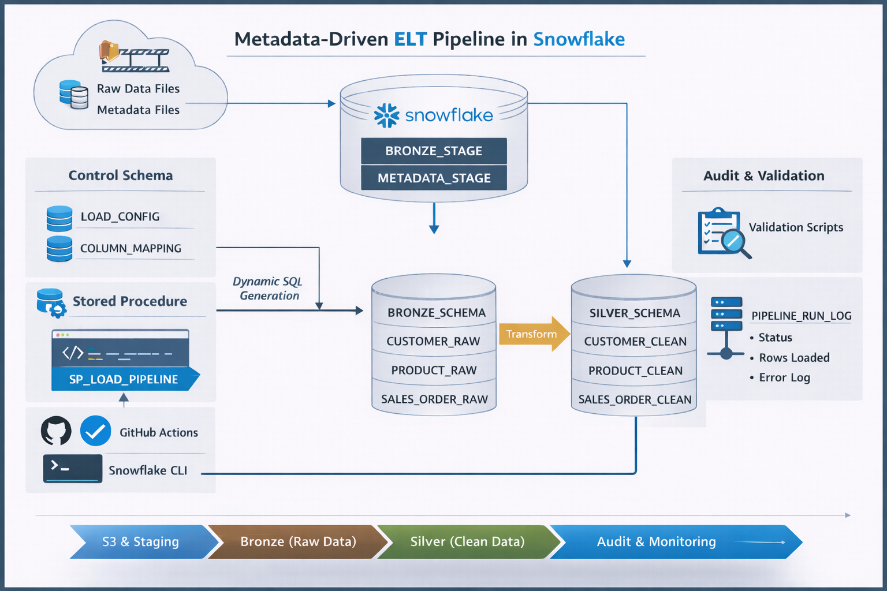

# 🚀 Metadata-Driven ELT Pipeline in Snowflake

## 📌 Overview
This project implements a metadata-driven ELT pipeline using Snowflake, Amazon S3, and GitHub Actions. The goal is to build a scalable and reusable data pipeline where new datasets can be onboarded without modifying core logic. Instead of writing separate SQL for each table, the pipeline dynamically generates SQL using metadata.

## 🏗️ Architecture

  

## 🔄 Data Flow
S3 → Snowflake Stage → Bronze Tables → Metadata (LOAD_CONFIG, COLUMN_MAPPING) → SP_LOAD_PIPELINE → Silver Tables → Validation → Audit Logging

## 🧱 Data Layers

### Bronze Layer (Raw Data)
Stores source-aligned data without transformations. Loaded from S3 using COPY INTO and acts as the system of record.

Tables:
- BRONZE.CUSTOMER_RAW  
- BRONZE.PRODUCT_RAW  
- BRONZE.SALES_ORDER_DETAIL_RAW  
- BRONZE.SALES_ORDER_HEADER_RAW  

### Silver Layer (Clean Data)
Applies data cleaning and standardization, including null handling and formatting.

Tables:
- SILVER.CUSTOMER_CLEAN  
- SILVER.PRODUCT_CLEAN  
- SILVER.SALES_ORDER_DETAIL_CLEAN  
- SILVER.SALES_ORDER_HEADER_CLEAN  

## ⚙️ Metadata-Driven Framework

### LOAD_CONFIG
Controls pipeline execution at a high level, including source table, target table, load type, and load mode.

### COLUMN_MAPPING
Defines column-level transformations, including target column names and transformation expressions.

## 🧠 Stored Procedure
SP_LOAD_PIPELINE acts as the execution engine. It reads metadata, dynamically builds SQL using LISTAGG, and executes transformations using EXECUTE IMMEDIATE. The same procedure is reused for multiple pipelines.

Example:
CALL CONTROL.SP_LOAD_PIPELINE('LOAD_CUSTOMER');
CALL CONTROL.SP_LOAD_PIPELINE('LOAD_PRODUCT');
CALL CONTROL.SP_LOAD_PIPELINE('LOAD_SALES_DETAIL');
CALL CONTROL.SP_LOAD_PIPELINE('LOAD_SALES_HEADER');

## 📊 Audit Logging
Pipeline execution is tracked using CONTROL.PIPELINE_RUN_LOG. It captures pipeline name, execution status, start and end time, rows processed, executed SQL, and error messages. This enables monitoring and debugging.

## ✅ Validation Layer
Validation scripts are used to ensure data quality, including duplicate checks, null checks, and data consistency validation.

## 🔁 CI/CD Pipeline
GitHub Actions is used to automate deployment and execution. It uses Snowflake CLI with JWT authentication to deploy schemas, tables, metadata, stored procedures, and execute pipelines.

Workflow steps include:
- Checkout repository  
- Authenticate with Snowflake  
- Deploy schemas and tables  
- Load metadata  
- Deploy stored procedures  
- Execute pipelines  
- Run validations  

## 🛠️ Tech Stack
Snowflake, SQL (Snowflake Scripting), Amazon S3, GitHub Actions, Snowflake CLI

## 💡 Key Features
- Metadata-driven ELT design  
- Dynamic SQL generation  
- Reusable pipeline framework  
- Separation of Bronze and Silver layers  
- CI/CD automation  
- Audit logging for observability  

## 🚧 Challenges & Learnings
- Debugging dynamic SQL generated from metadata  
- Handling errors in Snowflake stored procedures  
- Ensuring consistency between metadata and table structures  
- Designing reusable ELT frameworks instead of static pipelines  

## 🔮 Future Enhancements
- Incremental loading (CDC)  
- Slowly Changing Dimensions (SCD)  
- Gold layer (fact and dimension modeling)  
- Multi-table joins using metadata  

## 📌 Summary
This project demonstrates how to build a scalable metadata-driven ELT framework in Snowflake, enabling reusable and maintainable data pipelines aligned with modern data engineering practices.

## 👨‍💻 Author
Ganasai Palakurthi  
Portfolio: https://ganasaipalakurthi.netlify.app/  
GitHub: https://github.com/Ganasai-Palakurthi
